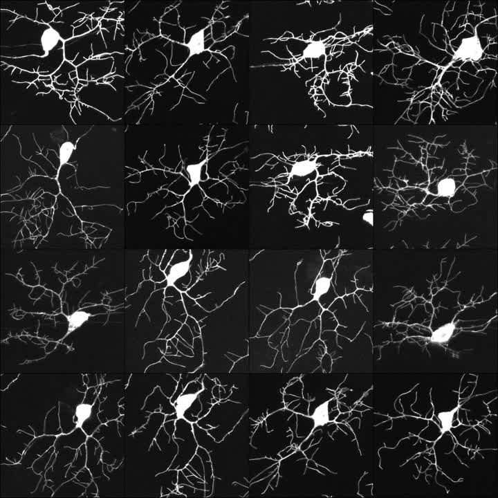

# neuron-gan
A neural network implemented in PyTorch to generate images of *Drosophila* class IV neurons.

## Introduction
In typical experimental setups, images are expensive to gather making statistical analysis difficult. The codebase of this repository attempts to remedy this problem by training a generative-adversarial network (GAN) to create new images of neurons using a small dataset of experimental images.

## Installation
### Option 1: Install packages with pip
1. Open a terminal and navigate to the root directory of this repository.
2. Activate a new virtual environment using `python=3.10`.
3. Install required packages with pip:
```
pip install -r requirements.txt
```


### Option 2: Install environment with conda
Create the `neuron-gan` environment using the `.yml` file:
```
conda env create -f requirements.yml
```
If training with cuda device is required, reinstall pytorch with gpu support:
```
conda install -c nvidia -c pytorch pytorch pytorch-cuda torchvision --force-reinstall
```
### Setup training dataset and weights
#### Automatic setup
Run `setup.py` and follow user prompts.

#### Manual setup
Download dataset from [here](https://drive.google.com/file/d/10Aqv57jU1RPsf2duOPHJe2asc6HYHOGc/view) and save the dataset folder in the `data` subfolder.

Download trained weights from [here](https://drive.google.com/file/d/12oYbsfjyvYR_MosDfzhPjuEwZcF5LrF3/view) and save the `.pth` file in the `weights` subfolder.

## Data
The dataset consists of 16 images of class IV neurons at a resolution of 512x512 and can be downloaded from [here](https://drive.google.com/file/d/10Aqv57jU1RPsf2duOPHJe2asc6HYHOGc/view).
The images were gathered and processed from the first frame of neuronal development movies.
The movies were extracted from `24_hr_RAW_DATA.zip` downloaded from [here](https://datadryad.org/stash/dataset/doi:10.5061/dryad.djh9w0w2r).



## Training
* Download image dataset and store them in a folder in the `data` subfolder.
* Copy the `config_ex.py` file in the `configs` folder and rename it to `my_config.py`.
* Define the `ID` variable in `my_config.py` defining the training run ID.
* Start training with the `my_config.py` configurations:
```
python train.py --configs my_config
```

## Evaluation
* Download the discriminator and generator weights from [here](https://drive.google.com/file/d/12oYbsfjyvYR_MosDfzhPjuEwZcF5LrF3/view) and save the `.pth` file in the `weights` subfolder.
* Generate 20 images with the weights stored in `gen_dis_default.pth` and save the images in `Generated_samples.png`:
```
python eval.py -n 20 -weights gen_dis_default.pth -output samples_default.png
```

## Architecture
The architecture of the network is inspired by progressively growing GANs (PGGANs) suggested in [Progressive Growing of GANs for Improved Quality, Stability, and Variation, 2017](https://arxiv.org/abs/1710.10196). Briefly, the generator first learns to generate low-resolution images and gradually increases its resolution until the final resolution is reached. The resolution starts at 16x16 and increases by a factor 2 at each resolution transition. After this transition, a new learning phase starts where the learning rate is initialized to 1e-4 and decreases exponentially to 1e-6 over the first half of the phase.

The discriminator loss function is based on the Wasserstein GAN (WGAN) loss with two extra terms:

$`
\mathcal{L}_{D} =  -\langle D(x) \rangle_{x \in Real} + \langle D(G(z)) \rangle_{z \in L} + \lambda \langle (\lVert\nabla D(y)\rVert_2 - 1)^2 \rangle_{y} + \epsilon_{\text{drift}} \langle D(x)^2 \rangle_{x \in Real}
`$

In the second term, $L$ indicates the latent space of the generator, which is formed by sampling normally-distributed random vectors normalized with the $L^2$ norm.

The third term corresponds to the gradient penalty term introduced in [Improved Training of Wasserstein GANs, 2017](http://arxiv.org/abs/1704.00028). This term is added as an alternative to weight clipping. The gradient is taken over random interpolations between real and generated images: $y = t x + (1-t)G(z)$ where $t$ is random and uniformly-distributed in $[0,1]$. $\lambda=10$ is used to weigh the penalty term.

The last term ensures that the critic score outputted by the discriminator does not drift and remains bounded throughout the training. $\epsilon_{\text{drift}} = 0.001$ is used to weight the drift term.

The generator loss is the same as the WGAN loss:

$`
\mathcal{L}_{G} = -\langle D(G(z)) \rangle_{z \in L}
`$

## Generated samples
Here is a timelapse of 16 images created by the generator over the training epochs.
The samples are created using fixed randomly sampled latent vectors. The resolution increases by a factor of 2 every 25k epochs.

<video src="https://user-images.githubusercontent.com/35376874/226381985-c4d75c45-781c-49e0-bf68-8bacdadbd8f0.mp4" controls="controls" style="max-height: 720px;">
</video>

## Future work
* Use LSGAN loss and compare performance

## References
* [Progressive Growing of GANs for Improved Quality, Stability, and Variation, 2017](https://arxiv.org/abs/1710.10196)
* [Improved Training of Wasserstein GANs, 2017](http://arxiv.org/abs/1704.00028)
